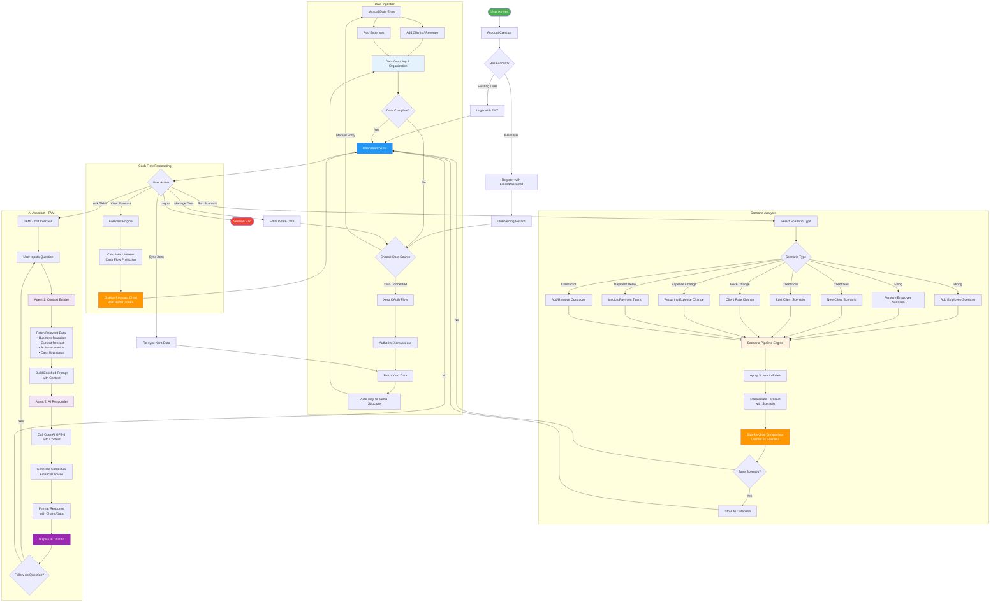

# Tamio Product Architecture

## Overview
Tamio is a cash flow forecasting platform designed for SMEs, combining manual data entry simplicity with powerful AI-driven insights and scenario planning capabilities.

## Technology Stack

### Frontend
- Single Page Application (HTML/JavaScript)
- Chart.js for data visualization
- Responsive design with mobile support

### Backend
- **Framework**: FastAPI (Python)
- **Database**: PostgreSQL with AsyncPG
- **ORM**: SQLAlchemy (Async)
- **Migrations**: Alembic
- **Authentication**: JWT tokens

### External Integrations
- **Xero API**: Accounting data synchronization
- **OpenAI GPT-4**: AI assistant (TAMI)

## Product Flow



## Core Features

### 1. Account Creation & Authentication
- JWT-based authentication
- Secure password hashing (bcrypt)
- Email/password registration
- Persistent sessions

### 2. Data Ingestion
Two primary data entry methods:

#### Manual Entry
- Clients and Revenue streams
- Employees and Payroll
- Recurring Expenses
- Custom billing cycles

#### Xero Integration
- OAuth 2.0 authentication flow
- Automatic data sync
- Smart mapping to Tamio data structure
- Bank account integration
- Invoice and contact synchronization

### 3. Cash Flow Forecasting
- **Time Horizon**: 13-week rolling forecast
- **Methodology**: Event-based projection engine
- **Visualization**: Interactive charts with buffer zones
- **Insights**: Cash runway, low-balance warnings, trend analysis

### 4. Scenario Analysis
12 scenario types supported:
- **People**: Hiring, Firing, Contractor changes
- **Revenue**: Client gain/loss, Rate changes
- **Expenses**: Increased/decreased recurring costs
- **Timing**: Payment delays (inbound/outbound)

**Pipeline Architecture**:
- Dynamic handler system
- Rule-based modifications
- Side-by-side comparisons
- Persistent scenario storage

### 5. TAMI AI Assistant
Two-agent architecture:

#### Agent 1: Context Builder
- Fetches relevant business data
- Analyzes current financial state
- Gathers forecast and scenario information
- Builds enriched prompt with context

#### Agent 2: AI Responder
- OpenAI GPT-4 integration
- Context-aware financial advice
- Natural language responses
- Multi-turn conversation support

---

## Behavior Analytics & Scoring System

Tamio uses a comprehensive behavior analytics system to provide insights into financial health and automatically trigger scenario suggestions. All thresholds are fixed business rules.

### Data Flow Architecture

```
┌─────────────────┐     ┌──────────────────┐     ┌─────────────────┐
│   Raw Data      │────▶│  Behavior Engine │────▶│    Metrics      │
│ (Clients,       │     │  (engine.py)     │     │  (12 Scores)    │
│  Expenses,      │     └──────────────────┘     └────────┬────────┘
│  Cash Accounts) │                                       │
└─────────────────┘                                       ▼
                                                 ┌────────────────┐
                                                 │  Trigger System │
                                                 │  (triggers.py)  │
                                                 └────────┬────────┘
                                                          │
                    ┌─────────────────────────────────────┼─────────────────────────────────────┐
                    │                                     │                                     │
                    ▼                                     ▼                                     ▼
           ┌────────────────┐                    ┌────────────────┐                    ┌────────────────┐
           │ Insights Page  │                    │    TAMI AI     │                    │   Triggered    │
           │  (Frontend)    │                    │   (Context)    │                    │   Scenarios    │
           └────────────────┘                    └────────────────┘                    └────────────────┘
```

---

### 1. Forecast Confidence Score

**Purpose**: Measures how reliable the cash flow forecast is based on data quality and integration status.

**Location**: `tamio-backend/app/integrations/confidence.py`

#### Calculation Logic

Each client and expense is assigned a confidence level based on accounting software integration:

| Level | Weight | Criteria |
|-------|--------|----------|
| **HIGH** | 100% | Linked to Xero/QuickBooks with a **repeating invoice/bill** |
| **MEDIUM** | 80% | Synced as contact/vendor but no recurring invoice/bill link |
| **LOW** | 50% | Manual entry with no accounting software link |

**Overall Score Formula:**
```
weighted_score = (high_amount × 1.0 + medium_amount × 0.8 + low_amount × 0.5) / total_amount
overall_percentage = weighted_score × 100
```

#### Display Thresholds

| Score Range | Level | Color |
|-------------|-------|-------|
| ≥ 90% | High | Green |
| 70-89% | Medium | Amber |
| < 70% | Low | Red |

#### Generated Insights

- Shows count of high/medium/low confidence items
- Displays improvement suggestions (e.g., "Create a repeating invoice in Xero for this client")

#### Platform Integration

- Displayed on Dashboard forecast card
- Included in TAMI context for advice quality awareness

---

### 2. Buffer Breach Status

**Purpose**: Traffic light indicator showing whether cash position is healthy, at risk, or in breach of buffer requirements.

**Location**: `tamio-backend/app/insights/engine.py` (lines 260-375)

#### Calculation Logic

```python
target_buffer = monthly_expenses × buffer_months  # default 3 months

# For each week in forecast:
if ending_balance <= 0:
    status = "BREACH"
elif ending_balance < target_buffer:
    status = "AT_RISK"
else:
    status = "HEALTHY"
```

#### Display Thresholds

| Condition | Status | Color | Badge Text |
|-----------|--------|-------|------------|
| `lowest_balance <= 0` | Breach | Red | "Buffer Breach" |
| `0 < lowest_balance < target_buffer` | At Risk | Amber | "At Risk" |
| `lowest_balance >= target_buffer` | Healthy | Green | "Cash Buffer Safe" |

#### Generated Insights

- Shows required buffer amount vs lowest projected balance
- Displays which week the lowest balance occurs
- Shows buffer coverage in months

#### Platform Integration

- Displayed on Dashboard forecast chart as colored badge
- Popover shows detailed breakdown
- Feeds into TAMI context as rule breach status

---

### 3. Insight Health Score

**Purpose**: Single 0-100 score summarizing overall financial health across three dimensions.

**Location**: `tamio-backend/app/insights/engine.py` (lines 418-422)

#### Calculation Logic

**Component Scores (each 0-100):**

1. **Income Health Score:**
   - Base: 100
   - -15 per high concentration client (capped at 45)
   - -10 per delayed payment client (capped at 30)
   - -20 if revenue_at_risk > 30%, OR -10 if > 15%

2. **Expense Health Score:**
   - Base: 100
   - -10 per rising expense category (capped at 30)
   - -15 per over-budget category (capped at 45)
   - -15 if variable_expenses > fixed_expenses AND variable_ratio > 0.6

3. **Cash Discipline Score:**
   - Based on buffer integrity ratio (current_buffer / target_buffer):
     - ratio ≥ 1.5: score = 100
     - ratio ≥ 1.0: score = 70 + (ratio - 1.0) × 60
     - ratio ≥ 0.5: score = 30 + (ratio - 0.5) × 80
     - ratio < 0.5: score = ratio × 60

**Overall Score:**
```
overall_score = (income_score + expense_score + cash_discipline_score) / 3
```

#### Display Thresholds

| Score Range | Label | Color |
|-------------|-------|-------|
| 81-100 | Excellent | Green |
| 61-80 | Healthy | Green |
| 41-60 | At Risk | Amber |
| 0-40 | Critical | Red |

#### Generated Insights

- Shows 6-week trend line of health score
- Displays component breakdown

#### Platform Integration

- Primary metric on Insights page
- Included in TAMI behavior context as `health_score` and `health_label`

---

### 4. Client Concentration

**Purpose**: Measures revenue diversification risk using a cash-weighted Herfindahl-Hirschman Index (HHI).

**Location**: `tamio-backend/app/behavior/engine.py` (lines 44-122)

#### Calculation Logic

```python
# For each client:
revenue_share = (client_monthly_amount / total_revenue) × 100

reliability_factor = 1.0   # if payment_behavior == "on_time"
                   = 0.85  # if payment_behavior == "delayed"
                   = 0.9   # if payment_behavior == "unknown"

cash_weighted_share = revenue_share × reliability_factor
is_high_concentration = revenue_share > 25

# HHI Calculation:
hhi = sum((amount / total_revenue)²)
concentration_score = max(0, min(100, (1 - hhi) × 100))
# Higher score = better diversification
```

#### Display Thresholds

| Condition | Risk Level | Display |
|-----------|------------|---------|
| Client > 40% of revenue | Critical | Red badge |
| Client > 25% of revenue | Warning | "HIGH" badge |
| Client ≤ 25% of revenue | Normal | No badge |

#### Generated Insights

- Donut chart showing top client revenue breakdown
- Highlights clients with HIGH concentration badge

#### Scenario Triggers

| Threshold | Trigger | Scenario Generated |
|-----------|---------|-------------------|
| Single client > 40% | High Revenue Concentration | "What if {client_name} churns?" |

#### Platform Integration

- Displayed on Insights page with pie chart
- Included in TAMI context as `client_concentration_risk` flag
- Triggers suggested scenarios

---

### 5. Revenue at Risk

**Purpose**: Probability-weighted estimate of revenue that may not be collected based on payment patterns.

**Location**: `tamio-backend/app/behavior/engine.py` (lines 206-271)

#### Calculation Logic

```python
# For each client:
risk_probability_30d = ((100 - reliability_score) / 100) × 0.6
risk_probability_60d = ((100 - reliability_score) / 100) × 1.0

at_risk_amount = client_monthly_amount × risk_probability

# Include in totals only if:
# - 30-day risk: risk_probability > 0.15 (15%)
# - 60-day risk: risk_probability > 0.10 (10%)

at_risk_percentage = total_at_risk_amount / total_revenue × 100
```

#### Display Thresholds

| Threshold | Status |
|-----------|--------|
| > 15% of revenue at risk | Warning threshold |
| ≤ 15% | Within acceptable range |

#### Generated Insights

- Shows 30-day and 60-day at-risk amounts
- Progress bars showing percentage of revenue at risk
- "Above threshold" or "Within threshold" badge

#### Scenario Triggers

| Threshold | Trigger | Scenario Generated |
|-----------|---------|-------------------|
| > 20% at risk | Revenue at Risk Elevated | "Multiple clients pay late" with AR escalation |

#### Platform Integration

- Displayed on Insights page
- Triggers collection-focused scenarios
- Included in TAMI context

---

### 6. Payment Reliability Score

**Purpose**: Per-client scoring of payment behavior including mean days to pay, variance, and trend.

**Location**: `tamio-backend/app/behavior/engine.py` (lines 132-202)

#### Calculation Logic

Based on `payment_behavior` field on Client model:

| Payment Behavior | Mean Days | Variance | Trend | Reliability Score |
|-----------------|-----------|----------|-------|-------------------|
| `on_time` | 7.0 | 3.0 | stable | 90.0 |
| `delayed` | 21.0 | 10.0 | worsening | 45.0 |
| `unknown` | 14.0 | 7.0 | stable | 65.0 |

**Overall Reliability (revenue-weighted):**
```
overall_reliability = sum(reliability_score × monthly_amount) / total_revenue
```

#### Display Thresholds

| Condition | Display |
|-----------|---------|
| mean_days > 14 | Red text |
| variance > 5 | Amber text |
| trend == "worsening" | Up arrow icon (bad) |
| trend == "improving" | Down arrow icon (good) |
| trend == "stable" | Dash icon |

**Overall Score Thresholds:**

| Score | Level |
|-------|-------|
| < 50.0 | Critical |
| < 70.0 | Warning |
| ≥ 70.0 | Healthy |

#### Generated Insights

- Table per client: Name, Mean Days, Variance, Trend, Monthly Amount, Risk Level

#### Scenario Triggers

| Threshold | Trigger | Scenario Generated |
|-----------|---------|-------------------|
| Reliability < 70 AND trend = "worsening" AND client > 15% revenue | Payment Reliability Drop | "{client_name} pays 21 days late for 2 cycles" |

#### Platform Integration

- Displayed on Insights page
- Included in TAMI context as `payment_reliability_warning` flag
- Triggers payment delay scenarios

---

### 7. Expense Volatility

**Purpose**: Measures how stable expense categories are over time using variance and drift metrics.

**Location**: `tamio-backend/app/behavior/engine.py` (lines 320-423)

#### Calculation Logic

```python
# Per category:
volatility_index = (unstable_bucket_count / total_buckets) × 100
# where is_stable = false indicates variable bucket

drift = (variable_amount / total_amount) × 10
# Simplified historical change proxy

trend = "rising"    if drift > 10
      = "declining" if drift < -5
      = "stable"    otherwise

is_concerning = (volatility_index > 50) OR (drift > 15)

# Overall:
overall_volatility = average(volatility_index) across all categories
overall_volatility_score = 100 - overall_volatility  # Inverted for display
```

#### Display Thresholds

| Volatility Index | Level |
|-----------------|-------|
| > 60% | Critical |
| > 40% | Warning |
| ≤ 40% | Healthy |

#### Generated Insights

- Horizontal bar chart by expense category
- Shows volatility percentage per category
- Flags categories with drift > 10%

#### Scenario Triggers

| Threshold | Trigger | Scenario Generated |
|-----------|---------|-------------------|
| volatility_index > 50 AND drift > 10% | Expense Category Drift | "{category} spend +{drift}% for 6 weeks" |

#### Platform Integration

- Displayed on Insights page
- Triggers expense control scenarios
- Included in TAMI context as `expense_volatility_warning` flag

---

### 8. Discretionary vs Non-Discretionary Expenses

**Purpose**: Classifies expenses into essential (non-discretionary) and deferrable (discretionary) categories.

**Location**: `tamio-backend/app/behavior/engine.py` (lines 424-441)

#### Calculation Logic

**Classification Rules:**
```python
non_discretionary_categories = {"payroll", "rent", "utilities", "insurance", "taxes"}

# For each expense bucket:
if bucket.priority in ("essential", "high") OR category.lower() in non_discretionary_categories:
    classification = "non_discretionary"
else:
    classification = "discretionary"

delayable_amount = discretionary_total × 0.7  # Assume 70% can be deferred
discretionary_percentage = discretionary_total / total_expenses × 100
```

#### Display Thresholds

| Discretionary % | Level |
|-----------------|-------|
| > 60% | Critical |
| > 40% | Warning |
| ≤ 40% | Healthy |

#### Generated Insights

- Horizontal stacked bar showing split
- Two-column breakdown: Non-Discretionary (essential) vs Discretionary (deferrable)
- Note: "Discretionary spend can be delayed under buffer stress"

#### Scenario Triggers

| Threshold | Trigger | Scenario Generated |
|-----------|---------|-------------------|
| discretionary_percentage > 45% | High Discretionary Spending | "Reduce discretionary spending by 20%" |

#### Platform Integration

- Displayed on Insights page
- Used to calculate delayable expenses during cash stress
- Included in TAMI context

---

### 9. Upcoming Commitments

**Purpose**: Calendar view of financial obligations due within the next 30 days.

**Location**: `tamio-backend/app/behavior/engine.py` (lines 456-535)

#### Calculation Logic

**Data Sources:**
1. `ObligationSchedule` table - filters: due_date within 30 days, status in ["scheduled", "due"]
2. `ExpenseBucket` with `due_day` field - calculates next due date

```python
# For each commitment:
commitment_type = "fixed" | "quarterly" | "annual" | "variable"
is_delayable = commitment_type not in ("fixed", "quarterly")
days_until_due = (due_date - today).days

# Aggregate:
commitments_30_days = sum(all commitment amounts)
```

#### Display

- Table: Commitment Name, Due Date, Amount, Type
- Sorted by due date ascending
- Limited to 10 items
- Shows total commitments amount at bottom

#### Generated Insights

- List of upcoming payments with due dates
- Highlights non-delayable vs delayable commitments

#### Platform Integration

- Displayed on Insights page
- Used by TAMI for cash flow timing advice
- Informs scenario planning for payment timing

---

### 10. Buffer Integrity

**Purpose**: Measures current cash buffer against target buffer requirement.

**Location**: `tamio-backend/app/behavior/engine.py` (lines 608-650)

#### Calculation Logic

```python
current_buffer = sum(CashAccount.balance) for user
target_buffer = monthly_expenses × buffer_months  # default 3 months

integrity_percentage = (current_buffer / target_buffer) × 100

# Status determination:
status = "healthy"   if integrity_percentage >= 100
       = "at_risk"   if integrity_percentage >= 70
       = "critical"  if integrity_percentage < 70

# Days below target estimation:
days_below_target = max(1, int((100 - integrity_percentage) / 10) × 7)
```

#### Display Thresholds

| Integrity % | Status | Color |
|-------------|--------|-------|
| ≥ 100% | Healthy | Green |
| 70-99% | At Risk | Amber |
| < 70% | Critical | Red |

#### Generated Insights

- Shows: Current Buffer, Target Buffer
- Visual progress bar with status coloring
- Displays: percentage of target + days below target
- Alert if below target

#### Scenario Triggers

| Threshold | Trigger | Scenario Generated |
|-----------|---------|-------------------|
| integrity < 100% | Buffer Integrity Breach | "Buffer below target for {days} days" |
| integrity < 70% | Buffer Critical | "Emergency buffer recovery" |

#### Platform Integration

- Displayed on Insights page
- Primary metric for TAMI cash advice
- Triggers AR/AP optimization scenarios
- Included in TAMI context as `buffer_integrity_breached` flag

---

### 11. Buffer Trend

**Purpose**: Analyzes weekly burn rate momentum to predict buffer trajectory.

**Location**: `tamio-backend/app/behavior/engine.py` (lines 652-722)

#### Calculation Logic

```python
# For each week in forecast (min 2 weeks):
weekly_changes = [ending_balance[week_i] - ending_balance[week_i-1] for each week]

avg_weekly_burn = mean(weekly_changes)
momentum_percentage = (avg_weekly_burn / current_cash) × 100

# Trend direction:
trend_direction = "building"  if avg_weekly_burn > 100
                = "burning"   if avg_weekly_burn < -100
                = "stable"    otherwise

# Runway calculation (if burning):
weeks_to_zero = current_cash / abs(avg_weekly_burn)  # only if avg_weekly_burn < 0
```

#### Display

- Line chart: buffer level over 8 weeks
- Reference line at target_buffer (dashed)
- Trend badge: Building (up arrow), Stable (dash), Burning (down arrow)
- Momentum percentage displayed

#### Scenario Triggers

| Threshold | Trigger | Scenario Generated |
|-----------|---------|-------------------|
| momentum < -5% (burning > 5%/week) | Negative Burn Momentum | "Stop buffer depletion" |

#### Platform Integration

- Displayed on Insights page
- Used by TAMI to provide runway warnings
- Triggers expense reduction scenarios

---

### 12. Reactive vs Deliberate Decisions

**Status: COMING SOON**

**Purpose**: Will track spending decisions made under buffer stress versus planned expenses.

**Planned Logic:**
```python
# Track user activity when buffer is below target
# Categorize expense approvals/creations as:
# - Reactive: Made when buffer_integrity < 100%
# - Deliberate: Made when buffer_integrity >= 100%

reactive_percentage = reactive_decisions / total_decisions × 100
average_decision_quality_score = 100 - reactive_percentage
```

**Planned Thresholds:**

| Reactive % | Level |
|------------|-------|
| > 30% | Critical (Red) |
| > 15% | Warning |
| ≤ 15% | Healthy |

**Planned Scenario Triggers:**

| Threshold | Trigger | Scenario Generated |
|-----------|---------|-------------------|
| reactive_percentage > 30% | High Reactive Decision Rate | "Improve decision quality through buffer building" |

**Implementation Note:** Requires `UserActivity` tracking table to be populated with expense approval/creation events correlated with buffer status at time of decision.

---

## TAMI Integration with Behavior Metrics

TAMI receives behavior insights through the `ContextPayload` which includes:

### BehaviorInsightsSummary

Injected into TAMI's context with:
- `health_score`: Overall 0-100 score
- `health_label`: "Healthy", "At Risk", or "Critical"
- `client_concentration_risk`: boolean flag
- `payment_reliability_warning`: boolean flag
- `expense_volatility_warning`: boolean flag
- `buffer_integrity_breached`: boolean flag
- `top_concerns`: List of up to 3 concern strings

### TriggeredScenarioSummary

List of auto-generated scenarios from trigger system:
- `trigger_name`: What triggered the scenario
- `scenario_type`: Type of scenario to run
- `severity`: "low", "medium", "high", "critical"
- `recommended_actions`: List of suggested actions

### Context Formatting

TAMI receives formatted text sections:
```
=== BEHAVIOR INSIGHTS ===
Health Score: 65/100 (At Risk)
⚠️ Client Concentration Risk: HIGH
⚠️ Payment Reliability: DECLINING
Top Concerns:
  - High client concentration: top client is 42% of revenue
  - Payment reliability declining for Acme Corp

=== TRIGGERED SCENARIOS ===
(2 scenarios need attention)
⚠️ What if Acme Corp churns? (client_loss)
   Status: pending, Severity: medium
   Actions: Run client loss scenario, Identify diversification opportunities
```

---

## Automatic Scenario Triggers

The trigger system evaluates metrics and auto-generates suggested scenarios:

### Trigger Configuration

Each trigger has:
- **Conditions**: Metric type, operator, threshold, additional filters
- **Scenario Template**: Type, name template, default parameters
- **Recommended Actions**: Suggested steps for user
- **Severity**: low, medium, high, critical
- **Priority**: 0-100 (higher = more urgent)
- **Cooldown**: Hours before trigger can fire again

### Default Triggers Summary

| Trigger Name | Metric | Threshold | Scenario Type | Severity | Cooldown |
|--------------|--------|-----------|---------------|----------|----------|
| Payment Reliability Drop | PAYMENT_RELIABILITY | < 70 | payment_delay | HIGH | 7 days |
| High Revenue Concentration | CLIENT_CONCENTRATION | > 40% | client_loss | MEDIUM | 14 days |
| Revenue at Risk Elevated | REVENUE_AT_RISK | > 20% | payment_delay | HIGH | 7 days |
| Expense Category Drift | EXPENSE_VOLATILITY | > 50 | increased_expense | MEDIUM | 7 days |
| High Discretionary Spending | DISCRETIONARY_RATIO | > 45% | decreased_expense | LOW | 14 days |
| Buffer Integrity Breach | BUFFER_INTEGRITY | < 100% | payment_delay_out | HIGH | 3 days |
| Buffer Critical | BUFFER_INTEGRITY | < 70% | payment_delay_out | CRITICAL | 1 day |
| Negative Burn Momentum | BURN_MOMENTUM | < -5% | decreased_expense | MEDIUM | 7 days |

### Trigger Response Options

Users can respond to triggered scenarios:
- **Run Scenario**: Creates and activates the suggested scenario
- **Dismiss**: Removes the suggestion (respects cooldown)
- **Defer**: Extends expiration by 3 days

## API Endpoints

### Authentication (`/api/v1/auth`)
- POST `/register` - User registration
- POST `/login` - User authentication
- POST `/refresh` - Token refresh

### Data Management (`/api/v1/data`)
- Clients, Employees, Contractors CRUD
- Invoices and Expenses management
- Recurring obligations tracking

### Forecasting (`/api/v1/forecast`)
- GET `/` - Generate forecast
- GET `/summary` - Forecast summary statistics

### Scenarios (`/api/v1/scenarios`)
- GET `/` - List scenarios
- POST `/` - Create scenario
- POST `/pipeline/run` - Execute scenario pipeline
- GET `/{id}/forecast` - Get scenario forecast

### TAMI (`/api/v1/tami`)
- POST `/chat` - Send message to TAMI
- GET `/context` - Get business context

### Xero (`/api/v1/xero`)
- GET `/auth/url` - Get OAuth URL
- POST `/auth/callback` - OAuth callback
- POST `/sync` - Trigger data sync
- GET `/status` - Sync status

## Database Schema

### Core Models
- **User**: Authentication and profile
- **Client**: Revenue sources
- **Employee**: Payroll obligations
- **Contractor**: Variable labor costs
- **Invoice**: Receivables
- **Expense**: Recurring costs
- **Scenario**: What-if analyses
- **XeroConnection**: Integration state

### Relationships
- Users → Multiple clients, employees, scenarios
- Clients → Multiple invoices
- Scenarios → Cloned forecast data

## Security Considerations
- JWT token authentication
- CORS configuration for allowed origins
- Password hashing with bcrypt
- OAuth 2.0 for Xero integration
- Environment-based configuration
- Database connection pooling with pre-ping

## Deployment
- FastAPI ASGI server (Uvicorn)
- PostgreSQL database
- Environment variables for configuration
- Database migrations via Alembic
- Static frontend deployment

## Future Enhancements
- Multi-currency support
- Team collaboration features
- Advanced reporting
- Mobile app
- Additional accounting integrations (QuickBooks, Sage)
- ML-based forecast improvements